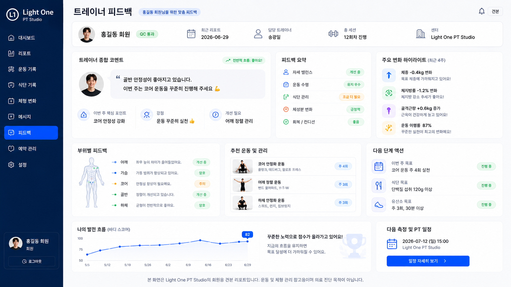
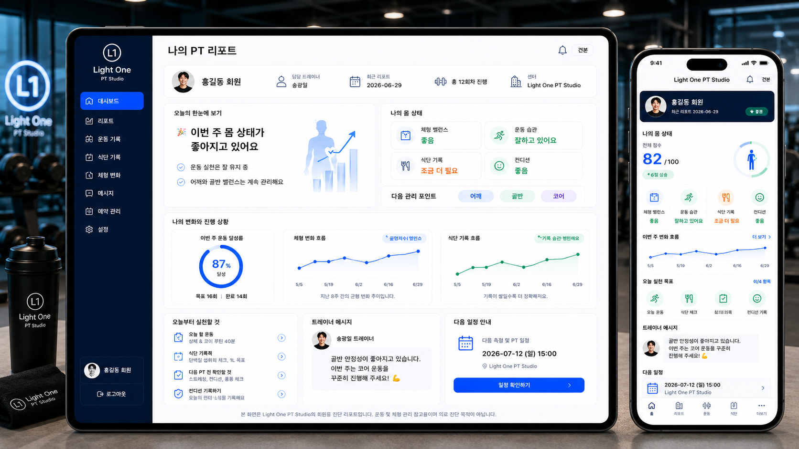
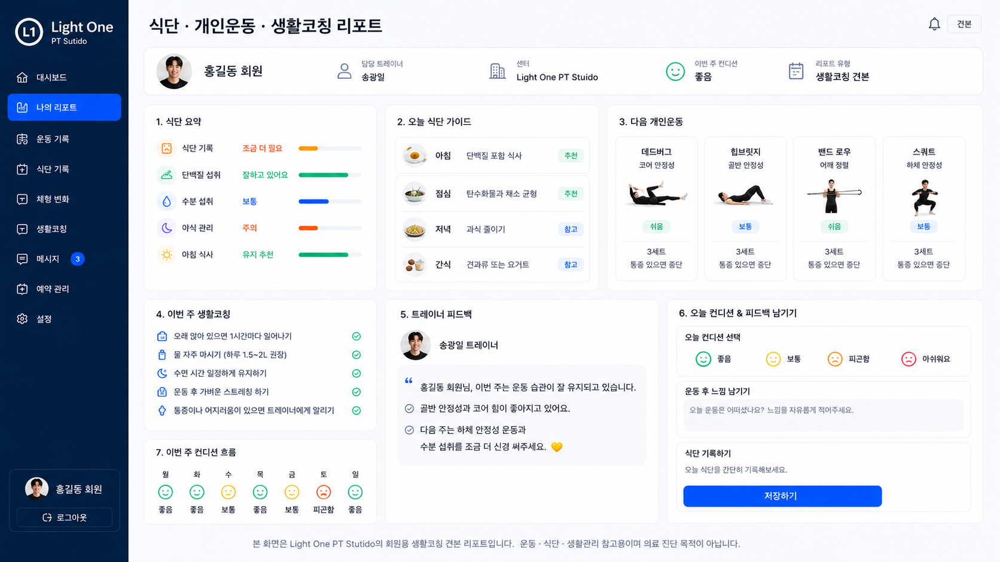
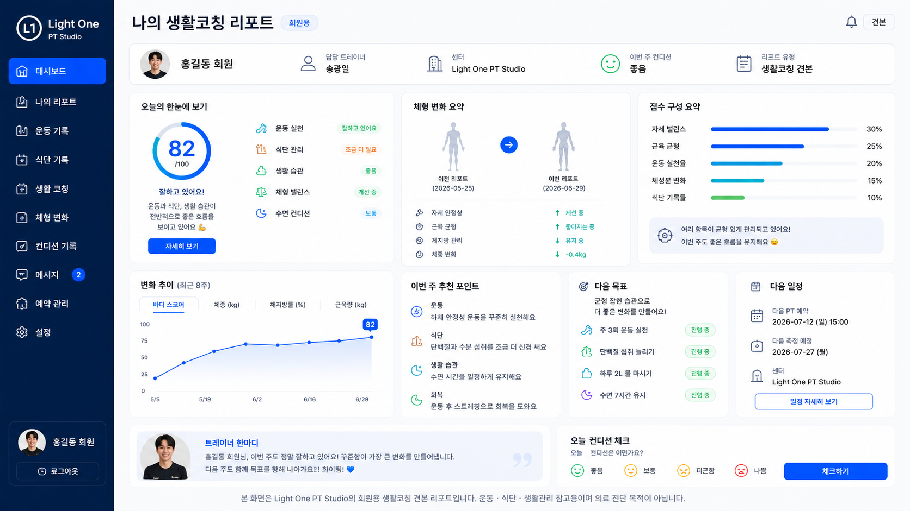
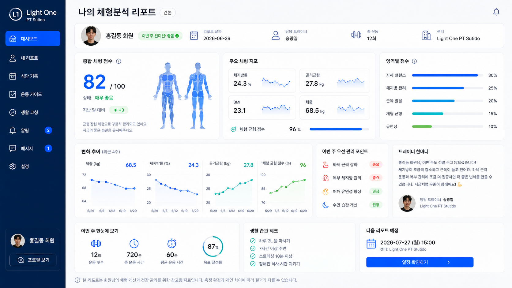
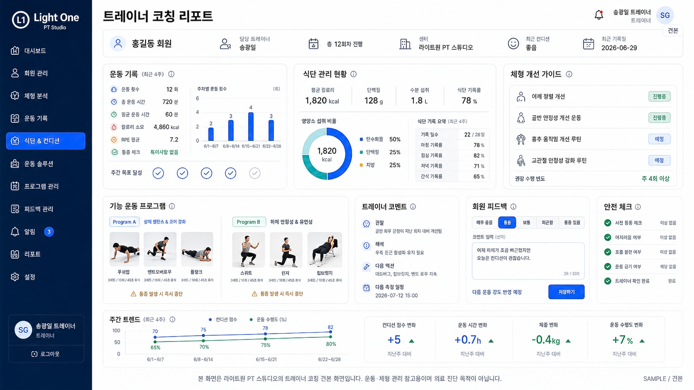
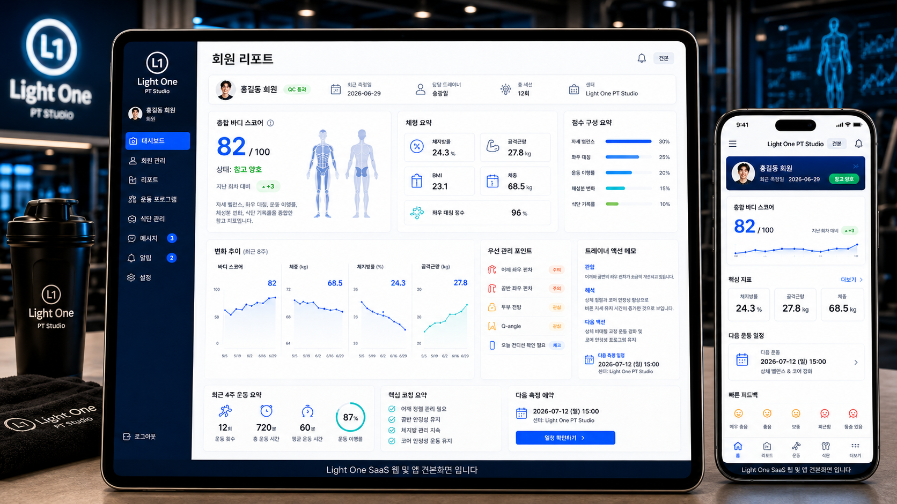
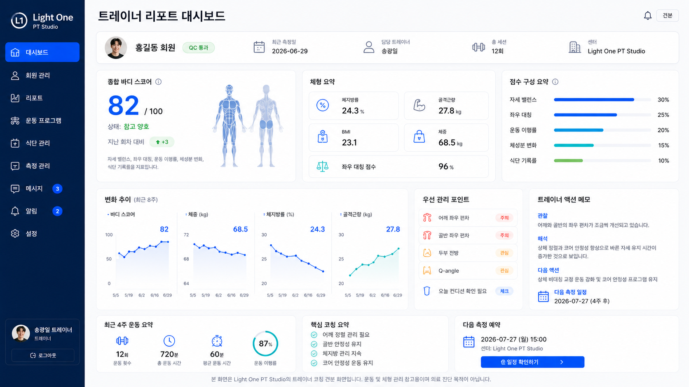
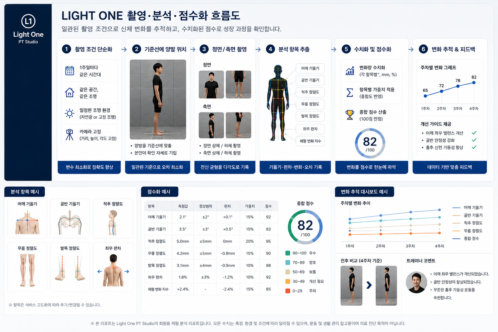

# LIGHT ONE V2

> 비의료 웰니스 체형·자세 레퍼런스 서비스 — Production Repository

## 개요

LIGHT ONE은 마커리스 포즈 추정(RTMPose, Apache 2.0) 기반의 체형 분석 서비스입니다. PT 센터와 트레이너에게 회원의 체형 변화를 수치화·시각화하여 제공하는 B2B SaaS를 목표로 합니다.

이 저장소는 **V2 프로덕션** 저장소로, 파일명이 정리되고 카테고리별로 분류된 자산을 관리합니다.

## 저장소 구조

```
lightoneV2/
├── README.md
├── assets/
│   ├── dashboard/
│   │   ├── center/                         ← 센터·회원용 대시보드 (5개)
│   │   │   ├── H_dashboard_v1.png
│   │   │   ├── H_dashboard_v2.png
│   │   │   ├── H_dashboard_detail_v1.png
│   │   │   ├── H_dashboard_multi_client_v1.png
│   │   │   └── H_dashboard_center_mgmt_v1.png
│   │   └── trainer/                        ← 트레이너용 대시보드 (4개)
│   │       ├── T_dashboard_demo_v1.png
│   │       ├── T_dashboard_demo_v2.png
│   │       ├── T_dashboard_v2.png
│   │       └── T_dashboard_exercise_v1.png
│   └── infographic/                        ← 인포그래픽 (1개)
│       └── info_plan_v1.png
└── docs/
    └── ASSET_DOCUMENTATION.md              ← 자산 문서
```

## 대시보드 미리보기

### 센터·회원용 대시보드

회원 개인의 체형 분석 결과, 피드백, 생활코칭, 식단·운동 리포트를 제공하는 화면입니다.

| 트레이너 피드백 (v1) | PT 리포트 웹+모바일 (v2) |
|:---:|:---:|
|  |  |

| 식단·개인운동·생활코칭 | 생활코칭 리포트 |
|:---:|:---:|
|  |  |

| 체형분석 리포트 |
|:---:|
|  |

### 트레이너용 대시보드

트레이너가 회원의 체형 데이터, 운동 프로그램, 코칭 메모를 관리하는 화면입니다.

| 리포트 대시보드 (데모 1) | 코칭 리포트 (데모 2) |
|:---:|:---:|
|  |  |

| 회원 리포트 웹+모바일 (v2) | 운동 프로그램 연동 |
|:---:|:---:|
|  |  |

### 서비스 흐름도

| 촬영·분석·점수화 흐름도 |
|:---:|
|  |

## 파일명 매핑 (V1 → V2)

| V1 원본 (lightone) | V2 정리 (lightoneV2) |
|---------------------|----------------------|
| `H_dashboard1.png` | `center/H_dashboard_v1.png` |
| `H_dashboard_2v.png` | `center/H_dashboard_v2.png` |
| `H_dashbord2.png` | `center/H_dashboard_detail_v1.png` |
| `H_dashborad3.png` | `center/H_dashboard_multi_client_v1.png` |
| `H_dashborad_4.png` | `center/H_dashboard_center_mgmt_v1.png` |
| `T_dashboard_demo_one.png` | `trainer/T_dashboard_demo_v1.png` |
| `T_dashboard_demo_two.png` | `trainer/T_dashboard_demo_v2.png` |
| `T_dashboard_2v.png` | `trainer/T_dashboard_v2.png` |
| `T_dashboard_three.png` | `trainer/T_dashboard_exercise_v1.png` |
| `info_plan.png` | `infographic/info_plan_v1.png` |

## 디자인 토큰

| 용도 | 색상 | 비고 |
|------|------|------|
| Primary | 네이비 (#1B2A4A 계열) | 사이드바, 헤더 |
| Accent | 블루 (#3B82F6 계열) | 활성 지표, CTA |
| Background | 화이트/라이트그레이 | 카드 배경 |
| Alert | 레드/오렌지 | 비정상 범위 강조 |
| Positive | 그린 | 정상·개선 표시 |

## 핵심 지표 (견본 데이터)

대시보드에 표시되는 견본 데이터 기준:

- 종합 바디 스코어: **82/100** (참고 양호)
- 체지방률: 24.3% / 골격근량: 27.8kg / BMI: 23.1 / 체중: 68.5kg
- 좌우 대칭 점수: 96%
- 운동 이행률: 87% (목표 16회 중 14회 완료)
- 점수 구성: 자세 밸런스 30%, 좌우 대칭 25%, 운동 이행률 20%, 체성분 변화 15%, 식단 기록률 10%

## 관련 저장소

| 저장소 | 용도 |
|--------|------|
| **lightone** | V1 아카이브 — 원본 자산 보관 |
| **lightoneV2** (이 저장소) | V2 프로덕션 — 정리된 자산, 개발용 |

## 포지셔닝

본 서비스는 **비의료 웰니스** 영역에 해당하며, 의료 진단·처방 목적이 아닙니다. 모든 화면의 하단 면책 문구: "운동 및 체형 관리 참고용이며 의료 진단 목적이 아닙니다."

## 라이선스

본 저장소의 디자인 자산은 LIGHT ONE 프로젝트 내부 사용 목적으로 제작되었습니다.
